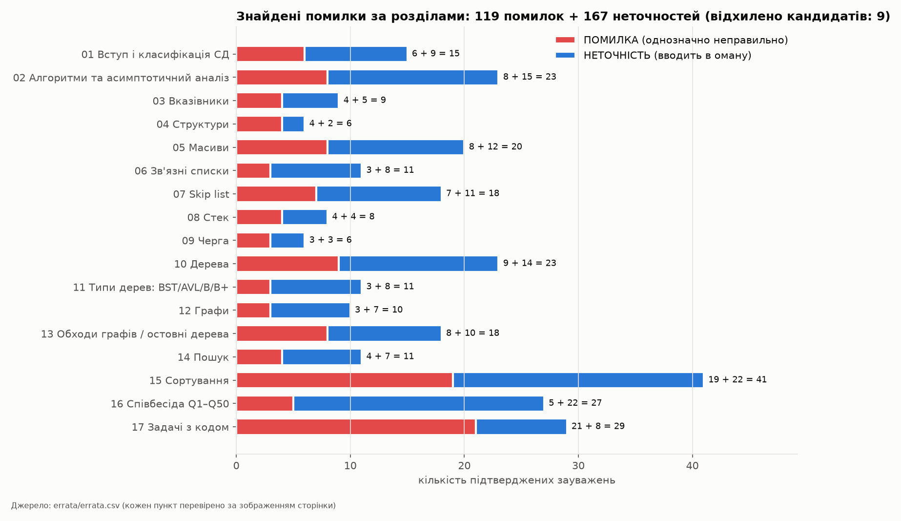

# DSA — рукописний конспект зі структур даних і алгоритмів, перевірений кодом на C і вимірами

Репозиторій для вивчення конспекту **«DSA Handwritten Notes»** (109 сторінок, Topper World) за принципом
*«не вір — перевір»*. До кожної теми є:

- **пояснення** українською з виправленнями ([`docs/`](docs/));
- **робочий код на C11** — 18 сортувань, 8 пошуків, списки, skip list, стек/черги/дек, BST/AVL/купа, графи ([`src/`](src/));
- **тести** під AddressSanitizer + UBSan: 227 436 перевірок, зокрема точних формул кількості операцій ([`tests/`](tests/));
- **бенчмарки** з реальними метриками цієї машини та **графіки**, побудовані тільки з CSV ([`bench/`](bench/), [`results/`](results/), [`charts/`](charts/));
- **експерименти**, що відтворюють помилки конспекту «до / після», а для UB — з реальним звітом санітайзера ([`experiments/`](experiments/));
- **повний реєстр помилок** конспекту, де кожен пункт перевірено за зображенням сторінки ([`errata/ERRATA-full.md`](errata/ERRATA-full.md));
- **дослівна транскрипція** рукопису з навмисно збереженими оригінальними помилками ([`transcript/`](transcript/)).

## Головне: у конспекті 286 зауважень



**119 однозначних помилок + 167 неточностей.** Ще 9 кандидатів перевірка відхилила: здебільшого це
були неправильно прочитані слова в рукописі.
Метод: 6 агентів незалежно транскрибували по ~18 сторінок. Потім 3 незалежні верифікатори повторно перевірили
**кожен** пункт за зображенням сторінки (130–400 dpi). C-код компілювали `clang -std=c11 -Wall -Wextra`
і запускали з ASan/UBSan, а трасування BFS/DFS, дерев та адресну арифметику переробляли вручну.

**36 зауважень — помилки компіляції (на 20 різних сторінках)**, ще кілька програм clang відхиляє через `void main`
(`error: 'main' must return 'int'`). Більшість C-програм конспекту в написаному вигляді не збираються.

### 12 найважливіших помилок

| # | Де | Помилка | Наслідок | Доказ |
|---|---|---|---|---|
| 1 | p.34, список | `malloc(sizeof(struct node *))` | виділяється 8 Б замість 16: **heap-buffer-overflow** | `ex_ub_malloc_sizeof_pointer` (ASan) |
| 2 | p.87, heap sort | `if (largest != 1)` замість `!= i` | **нескінченна рекурсія** → SIGSEGV | `ex_heapify_bug` |
| 3 | p.83, «bucket sort» | `int bucket[max]`, індекси 0..max; насправді це counting sort | **stack-buffer-overflow** | `ex_ub_counting_bucket` (ASan+UBSan) |
| 4 | p.107, стек | `isfull: top == MAXSIZE` | запис `stack[8]` у масив з 8 елементів | `ex_ub_stack_isfull` (ASan) |
| 5 | p.16–17 | «Ω = best case, Θ = average, O = worst» | концептуальна помилка: межі ≠ випадки | [02](docs/02-algorithms-asymptotics.md) |
| 6 | p.69, DFS | вершина позначається в момент push | порядок **не є DFS**: A D C B замість A D B C | `ex_dfs_mark_on_push` |
| 7 | p.79–80, bubble | псевдокод робить 1 прохід; C-код — exchange sort; «best O(n)» без прапорця | не сортує / не той алгоритм | `ex_bubble_variants` |
| 8 | p.89, insertion | `temp <= a[j]` | **нестабільне**; Θ(n²) на однакових ключах (127 992 000 зсувів при n=16000 проти 0) | `ex_insertion_le` |
| 9 | p.38–39, skip list | у `while` немає `< key` і просування; перев'язування по неправильних рівнях | псевдокод не працює | [06](docs/06-skip-list.md) |
| 10 | p.25, масиви | `BA + size·(first − index)` | знак навпаки; власний приклад конспекту рахує за правильною формулою | [04](docs/04-arrays.md) |
| 11 | p.69, остовне дерево | «edges = edges(graph) − 1» | правильно \|V\| − 1 | [09](docs/09-graphs.md) |
| 12 | p.74, 77 | `(beg + end) / 2`, `scanf("%d", item)` без `&` | переповнення int (UB) / UB | `ex_binary_overflow` |

## Маршрут навчання

| Крок | Розділ конспекту (стор. зошита) | Документ | Код | Зауважень |
|---|---|---|---|---|
| 0 | — | [Методика вимірювань](docs/00-methodology.md) | `bench/bench_util.h` | — |
| 1 | Вступ, класифікація (3–8) | [01](docs/01-intro-classification.md) | — | 15 |
| 2 | Алгоритми, асимптотика (8–17) | [02](docs/02-algorithms-asymptotics.md) | `bench/bench_ops.c` | 23 |
| 3 | Вказівники, структури (18–22) | [03](docs/03-pointers-structures.md) | `experiments/ex_struct_padding.c` | 9 + 6 |
| 4 | Масиви (22–30) | [04](docs/04-arrays.md) | `bench/bench_ds.c` (traverse) | 20 |
| 5 | Зв'язні списки (29–36) | [05](docs/05-linked-lists.md) | `src/list.c` | 11 |
| 6 | Skip list (36–40) | [06](docs/06-skip-list.md) | `src/skiplist.c` | 18 |
| 7 | Стек і черга (41–47) | [07](docs/07-stack-queue.md) | `src/stack_queue.c` | 8 + 6 |
| 8 | Дерева, BST, AVL, B/B+, купа (48–62) | [08](docs/08-trees.md) | `src/tree.c` | 23 + 11 |
| 9 | Графи, BFS/DFS, MST (62–71) | [09](docs/09-graphs.md) | `src/graph.c` | 10 + 18 |
| 10 | Пошук (71–78) | [10](docs/10-searching.md) | `src/search.c` | 11 |
| 11 | Сортування (78–92) | [11](docs/11-sorting.md) | `src/sort.c` | 41 |
| 12 | 50 питань співбесіди (93–103) | [12](docs/12-interview-qa.md) | — | 27 |
| 13 | Задачі з кодом (104–108) | [13](docs/13-coding-questions.md) | — | 29 |

Як працювати з кожним розділом: прочитати сторінки конспекту (`transcript/`) → документ `docs/NN` →
код у `src/` → запустити відповідний експеримент і подивитися графік → закрити реєстр помилок для розділу
і спробувати знайти кожну помилку самостійно, перш ніж читати пояснення.

## Що показали виміри (Apple M4 Pro)

| Експеримент | Результат | Графік |
|---|---|---|
| Обхід масиву vs перемішаного списку, n = 2²⁴ | 0.044 vs 111.3 нс/елемент — **у ~2 500 разів**, хоча обидва Θ(n) | [traverse](charts/traverse.png) |
| BST на відсортованому вході vs AVL, n = 32 768 | висота 32 768 vs 16; пошук у **1 503 рази** повільніший | [bst_avl](charts/bst_avl.png) |
| Бінарний пошук vs Eytzinger layout, 4 МБ | 71.8 vs 17.5 нс (**4.1×**) — та сама O(log n), зміна лише розкладки даних | [search_time](charts/search_time.png) |
| Interpolation search: рівномірні випадкові vs скошені ключі, n = 2²⁰ | 11.6 vs 1 746 порівнянь у середньому (binary: 36.9) | [search_ops](charts/search_ops.png) |
| Quicksort Lomuto (pivot = last) на відсортованому, n = 16 384 | 134 209 536 = n(n−1)/2 порівнянь | [sort_ops](charts/sort_ops.png) |
| Ріст динамічного масиву +1024 vs ×2 (з memcpy), n = 2²⁰ | 28.0 vs 0.31 нс/push; через `realloc` на macOS різниці **немає**: блок дорощується на місці | [stack_growth](charts/stack_growth.png) |
| Skip list, пам'ять при p = 1/2, 1/4, 1/8 | 2.001 / 1.334 / 1.144 вказівника на вузол = 1/(1−p) | [skiplist](charts/skiplist.png) |
| BFS: матриця vs CSR, V = 16 384, E = 4V | 62.8 мс vs 0.30 мс; 256 МБ vs 640 КБ. На повному графі (V = 4096) — 3.9 vs 4.3 мс: матриця наздоганяє | [graph_bfs](charts/graph_bfs.png) |
| Побудова купи: Флойд vs n × push, 2²⁴ | 2.56 vs 7.09 нс/елемент | [heap_build](charts/heap_build.png) |
| Insertion vs merge на малих n | insertion швидший до n = 128, повільніший з n = 256 | `ex_small_n_crossover` |

У [методиці](docs/00-methodology.md) описано, з виправленнями:
- 5 пасток вимірювань, на які я сам натрапив: роздільність таймера macOS 1 мкс, префетч за межі масиву,
  затримка FP-додавання, `realloc` на місці, кодогенерація bubble;
- 6 моїх прогнозів, які виміри спростували;
- 6 дефектів методики й 3 баги в коді, знайдені незалежним код-рев'ю (дані після цього перегенеровано).

Це частина навчального матеріалу: так виглядає перевірка тверджень на практиці.

## Запуск

```sh
make test                 # юніт-тести під ASan + UBSan
make experiments          # усі демонстрації помилок конспекту
make bench                # ~3–5 хв → results/*.csv
python3 -m venv .venv && .venv/bin/pip install matplotlib numpy
make plots                # charts/*.png з results/*.csv
```

Потрібні лише C11-компілятор (clang/gcc) і make; Python тільки для графіків.
`experiments/ex_ub_*` збираються з `-fsanitize=address,undefined`: баговий код запускається в дочірньому
процесі, і видно справжній звіт санітайзера.

## Структура

```
include/      заголовки (API з коментарями: складність, конвенції, крайні випадки)
src/          реалізації
tests/        юніт-тести (minitest.h — 30 рядків, без залежностей)
bench/        бенчмарки → results/*.csv
experiments/  відтворення помилок конспекту та пасток вимірювань
scripts/      plot.py — графіки тільки з CSV
results/      сирі виміри (CSV)
charts/       графіки (PNG)
docs/         пояснення по розділах
errata/       ERRATA-full.md (286 + 9 відхилених), errata.csv
transcript/   дослівна транскрипція рукопису (англійською)
```

## Обмеження (чесно)

- Абсолютні часи — для однієї машини (Apple M4 Pro, macOS 27, clang 21). Форма кривих переноситься, числа — ні.
- Апаратні лічильники (cache/branch miss) на macOS без root недоступні. Пояснення через кеш спираються на
  положення зламів кривих відносно розмірів L1/L2, а не на прямий вимір промахів.
- Транскрипція рукопису виконана за зображеннями. Місця, де почерк неоднозначний, позначені в errata
  (наприклад, P6-N4 — «low confidence»).
