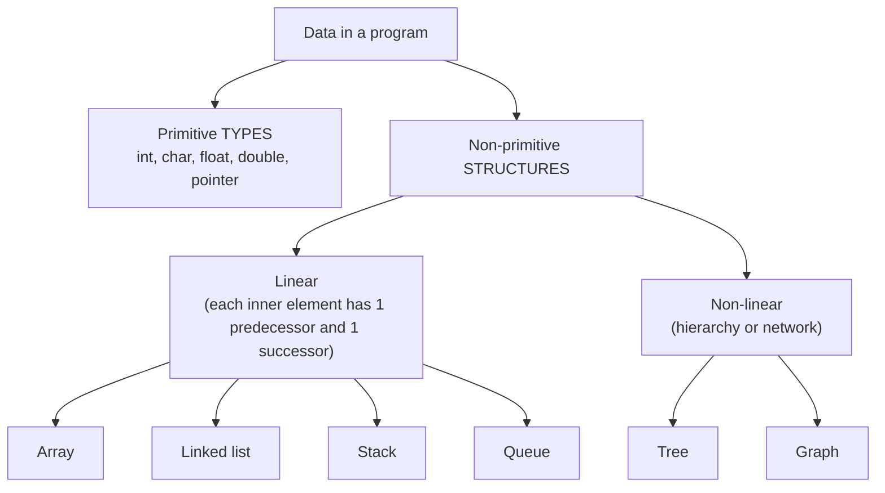

# 01. Data structures: definition and classification

Notes: notebook p.3–8 (PDF p.4–9). Transcript: [`transcript/part-01.md`](../transcript/part-01.md).
Errors in this chapter: [`errata/ERRATA-full.md` → chapter 01](../errata/ERRATA-full.md).

## Short and correct

A **data structure** is a way of organizing data in memory *together with the operations* on it and
guarantees about their cost. The notes (P1-01) call it "a set of algorithms", and that is wrong:
an algorithm *uses* a structure but is not one.

An **abstract data type (ADT)** is a *specification*: a set of values and operations without describing the implementation
("what"). A data structure is an *implementation* of an ADT ("how"). Example: the "stack" ADT (push/pop/peek, LIFO) is implemented
with an array (`src/stack_queue.c: stack`) or a list. On p.4 (P1-06) the notes call ADTs "algorithms",
even though on p.5 they correctly write "ADT tells what".

> The notes say "primitive data structure" (P1-02). More precisely — *primitive data types*; structures
> begin where several values are organized together.

### Linear vs non-linear — the exact criterion

| | Linear | Non-linear |
|---|---|---|
| Criterion | elements form **a single sequence**: each one except the ends has exactly 1 predecessor and 1 successor | an element can have **several** predecessors/successors |
| The notes | "connected to only one another element" (P1-03, imprecise: an inner element has *two* neighbors) | "arranged in a random manner" (P1-05, imprecise: they are ordered *hierarchically* or *as a network*, not randomly) |
| Traversal | one pass from first to last | needs a strategy: DFS/BFS |

Important: **linearity is a property of the logical structure, not of the memory layout.** A linked list
is linear even though its nodes are scattered across memory (see error P6-36 in interview question Q10).

### Static vs dynamic

The notes classify stack and queue as dynamic (P1-11). It depends on the implementation: a stack on a
fixed array (`int stack[8]`, as in coding question 3) is static; on a dynamic array
(`stack_push` with doubling) or a list it is dynamic.

## Operations and their limits

| Operation | What the notes say | Correct version |
|---|---|---|
| Insertion | "size n ⇒ only n−1 elements can be inserted" (P1-12, **error**) | a structure of capacity n holds **n** elements; inserting into a full one is an overflow. Verified: `cq_init(&q, 3)` holds 3 (test `test_stack_queue`) |
| Searching | "two algorithms: linear and binary" (P1-13) | there are two basic ones for an array, but there are also hashing, interpolation, jump, exponential, BST — 8 are implemented in `src/search.c` |
| Merging | "two lists are combined into a third of size M+N" (P1-14) | in DSA *merging* = two **sorted** lists → one sorted list in Θ(M+N) (`merge()` in `src/sort.c`) |

## Errors in the examples

- **"60 employees … 20 records"** (P1-07, p.5): one record per employee → 60 records. Verified at 400 dpi.
- **"inventory size of 106 items"** (P1-N1, p.6): the original source had 10⁶ — the superscript got lost.
  The argument "search slows down as data grows" is meaningless for 106 elements:
  linear search over 96 ints takes 18 ns, over 128 — 21 ns (`results/search_time.csv`, `linear`).

## Check yourself

1. Why is a singly linked list a linear structure even though its nodes are not adjacent in memory?
2. Name an ADT and two of its implementations from this repository with different asymptotics for the same operation.
   *(Answer: "queue" — `cqueue` (enqueue O(1)) and `lqueue` (enqueue O(1), but space is not reused —
   see `test_stack_queue`, "overflow" with 2 free cells).)*
