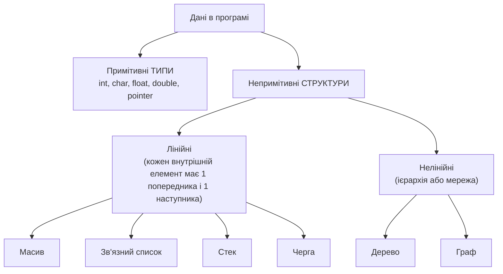

# 01. Структури даних: визначення і класифікація

Конспект: notebook p.3–8 (PDF p.4–9). Транскрипт: [`transcript/part-01.md`](../transcript/part-01.md).
Помилки розділу: [`errata/ERRATA-full.md` → розділ 01](../errata/ERRATA-full.md).

## Коротко і правильно

**Структура даних** — це спосіб організації даних у пам'яті *разом з операціями* над ними та
гарантіями їхньої вартості. Конспект (P1-01) називає її «набором алгоритмів», і це неправильно:
алгоритм *використовує* структуру, але не є нею.

**Абстрактний тип даних (ADT)** — це *специфікація*: множина значень і операцій без опису реалізації
(«що»). Структура даних — *реалізація* ADT («як»). Приклад: ADT «стек» (push/pop/peek, LIFO) реалізується
масивом (`src/stack_queue.c: stack`) або списком. Конспект на p.4 (P1-06) називає ADT «алгоритмами»,
хоча сам на p.5 правильно пише «ADT tells what».

> Конспект каже «primitive data structure» (P1-02). Точніше — *примітивні типи даних*; структури
> починаються там, де є організація кількох значень.

### Лінійна vs нелінійна — точний критерій

| | Лінійна | Нелінійна |
|---|---|---|
| Критерій | елементи утворюють **одну послідовність**: кожен, крім крайніх, має рівно 1 попередника і 1 наступника | елемент може мати **кілька** попередників/наступників |
| Конспект | «connected to only one another element» (P1-03, неточно: внутрішній елемент має *двох* сусідів) | «arranged in a random manner» (P1-05, неточно: вони впорядковані *ієрархічно* або *мережею*, а не випадково) |
| Обхід | один прохід від першого до останнього | потрібна стратегія: DFS/BFS |

Важливо: **лінійність — властивість логічної структури, а не розташування в пам'яті.** Зв'язний список
лінійний, хоча вузли розкидані по пам'яті (див. помилку P6-36 в інтерв'ю-питанні Q10).

### Статичні vs динамічні

Конспект відносить стек і чергу до динамічних (P1-11). Це залежить від реалізації: стек на
фіксованому масиві (`int stack[8]`, як у coding question 3) — статичний; на динамічному масиві
(`stack_push` з подвоєнням) або списку — динамічний.

## Операції та їхні межі

| Операція | Що каже конспект | Як правильно |
|---|---|---|
| Insertion | «size n ⇒ можна вставити тільки n−1 елементів» (P1-12, **помилка**) | структура місткості n вміщує **n** елементів; вставка в повну — overflow. Перевірено: `cq_init(&q, 3)` вміщує 3 (тест `test_stack_queue`) |
| Searching | «два алгоритми: linear і binary» (P1-13) | базових для масиву два, але є ще hashing, interpolation, jump, exponential, BST — 8 реалізовано в `src/search.c` |
| Merging | «два списки об'єднуються в третій розміру M+N» (P1-14) | у DSA *злиття* = два **відсортовані** списки → один відсортований за Θ(M+N) (`merge()` у `src/sort.c`) |

## Помилки в прикладах

- **«60 employees … 20 records»** (P1-07, p.5): один запис на працівника → 60 записів. Перевірено на 400 dpi.
- **«inventory size of 106 items»** (P1-N1, p.6): у першоджерелі було 10⁶ — верхній індекс загубився.
  Аргумент «пошук сповільнюється з ростом даних» безглуздий для 106 елементів:
  лінійний пошук по 96 int займає 18 нс, по 128 — 21 нс (`results/search_time.csv`, `linear`).

## Перевір себе

1. Чому однозв'язний список — лінійна структура, хоча вузли не лежать поруч у пам'яті?
2. Назвіть ADT і дві його реалізації з цього репозиторію з різною асимптотикою однієї операції.
   *(Відповідь: «черга» — `cqueue` (enqueue O(1)) і `lqueue` (enqueue O(1), але місце не перевикористовується —
   див. `test_stack_queue`, «overflow» при 2 вільних клітинках).)*
