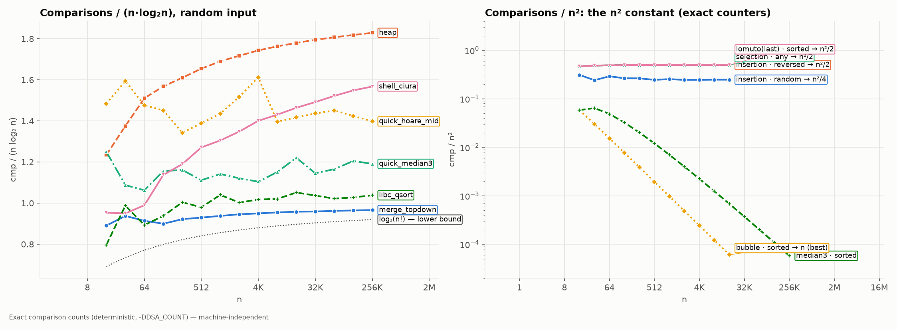

# 02. Algorithms and asymptotic analysis

Notes: notebook p.8–17 (PDF p.9–18). Errors: chapter 02 in [`errata/ERRATA-full.md`](../errata/ERRATA-full.md).

## Properties of an algorithm (Knuth, TAOCP vol.1 §1.1)

| Property | The notes | Correct |
|---|---|---|
| Finiteness | "limited number of instructions" (P1-16, **error**) | the algorithm **terminates** after a finite number of *steps*. A 3-line program `while(1);` has few instructions but is not finite |
| Effectiveness | the sentence is garbled (P1-17) | every operation is basic enough to be carried out exactly and in finite time |
| Input | "0 or some input" | zero or more inputs |
| Output | — | one or more outputs |
| Definiteness | — | every step is defined unambiguously |

## Paradigms

- **Divide and conquer** (P1-19, **error** in the notes: "breaks down the algorithm … in different methods"):
  1) *divide* the problem into smaller subproblems **of the same kind**; 2) *solve* them recursively;
  3) *combine* the results. Examples in the repository: `sort_merge`, `sort_quick_*`, `search_binary_recursive`.
- **Greedy** (P1-21, **error**: "very rarely gives the optimum"): a greedy algorithm is optimal when
  the problem has the *greedy-choice property* and *optimal substructure* (CLRS §16.2). This is how
  Huffman codes, minimum spanning trees (Kruskal/Prim), shortest paths without negative weights (Dijkstra),
  activity selection and fractional knapsack are solved. It is not optimal for 0/1 knapsack or coin change in an arbitrary coin system.

## Asymptotic notation — exact definitions (CLRS §3.1)

For functions f, g : ℕ → ℝ≥0:

| Notation | Definition | Meaning |
|---|---|---|
| f = O(g) | ∃ c > 0, n₀: 0 ≤ f(n) ≤ c·g(n) ∀ n ≥ n₀ | upper bound |
| f = Ω(g) | ∃ c > 0, n₀: 0 ≤ c·g(n) ≤ f(n) ∀ n ≥ n₀ | lower bound |
| f = Θ(g) | ∃ c₁, c₂ > 0, n₀: c₁·g(n) ≤ f(n) ≤ c₂·g(n) ∀ n ≥ n₀ | tight bound; Θ ⇔ both O and Ω |

### The main conceptual error in the notes

The notes (P1-29, P1-34) claim: "**Ω describes the best case, Θ the average case, O the worst case**".
This is **wrong**, and it is the most common mistake in interviews.

- **O / Ω / Θ** are kinds of *bounds* on a function.
- **best / average / worst** is *which function* we analyze: T_best(n) = min over inputs of size n,
  T_worst(n) = max, T_avg(n) = expected value under a given distribution.

Any of the three functions can be bounded with any kind of bound. An example with measured counters
(`results/sort_ops.csv`, n = 16384):

| Insertion sort | Function | Measured (comparisons) | Tight bound |
|---|---|---|---|
| best (sorted) | T_best(n) = n − 1 | 16 383 | **Θ(n)** |
| average (random) | ≈ n²/4 | 66 749 931 (n²/4 = 67 108 864) | **Θ(n²)** |
| worst (reversed) | n(n−1)/2 | 134 209 536 = 16384·16383/2 | **Θ(n²)** |

So "worst case of insertion sort = Θ(n²)" and "best case = Θ(n)" are both statements using Θ.
And "insertion sort = O(n²)" (without specifying the case) is a correct but imprecise statement about all cases.

*Right panel: cmp/n² for various (algorithm, input) pairs converges to the constants 1/4 and 1/2 — this is
"the constant that Θ hides". Left: cmp/(n·log₂n) for n log n algorithms; the dashed line is the information-theoretic lower bound
log₂(n!) for any comparison sort. Merge sort (0.96 at n=2¹⁸) is almost on it.*

### Other imprecisions in this chapter

- "n is steps required to execute program" (P1-31, **error**): n is the *input size*, f(n) is the number of steps.
- The diagram and definition of Θ are placed under the "Omega" heading (P1-30), and the Omega section is repeated on p.17.
- "Space complexity = Auxiliary space + Input size" (P1-N2): what is added is the *memory occupied by the input*, not its "size".
  Most sources and interviews mean **only auxiliary memory** by "space complexity" — you need to state the convention.

## Experiment: asymptotics vs constants

Asymptotics tells you what happens as n → ∞. At real n, constants and memory decide:

- `insertion` (Θ(n²)) is faster than merge sort (Θ(n log n)) up to and including n = 128, and at n = 256 it is already slower
  (`experiments/ex_small_n_crossover.c`, merge with a preallocated buffer: n=64 — 9.37 vs 12.52 ns/elem,
  n=128 — 13.93 vs 14.40, n=256 — 23.30 vs 16.18; the crossover between 128 and 256 is the same in both runs). That's why real sorts switch to insertion
  for small subarrays (`quick_median3` does this for ≤ 17 elements). A `malloc` of the buffer on every call
  (`merge_topdown`) noticeably hurts only at n ≤ 16 (n=4: 11.43 vs 7.07 ns/elem).
- `heap` makes ~1.8·n·log₂n comparisons (1.9 times more than merge) and has worse memory access.
  That's why at n = 4M it is slower than `merge_topdown` (51.8 vs 40.3 ns/elem, `sort_time.csv`).

## Check yourself

1. Is the statement "quicksort has Ω(n log n) complexity in the worst case" correct? *(Yes: worst Θ(n²) ⇒ both Ω(n log n) and Ω(n²).)*
2. Why does `selection sort` have T_best = T_worst = Θ(n²), while `bubble` with a flag does not? Check in `results/sort_ops.csv`.
