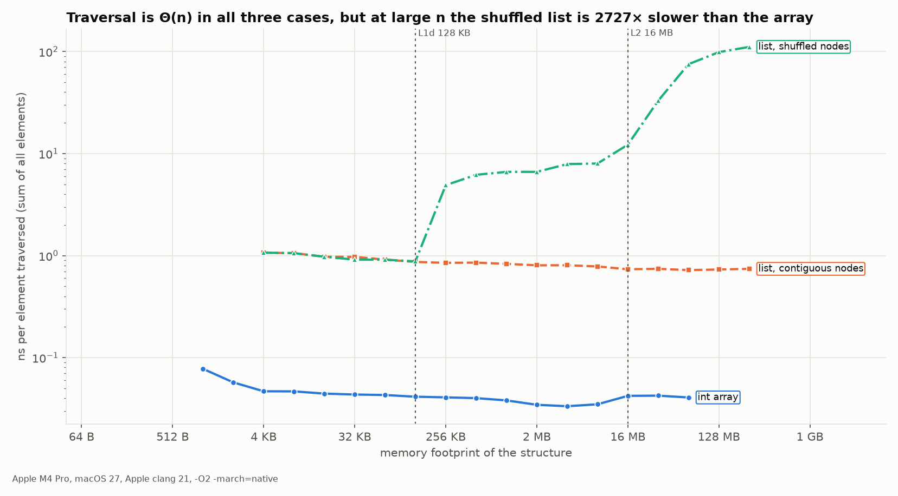

# 04. Arrays

Notes: notebook p.22–30 (PDF p.23–31). Errors: chapter 05 in [`errata/ERRATA-full.md`](../errata/ERRATA-full.md).

## Address formula — the notes have a sign error

The notes, p.25 (P2-24):

> Byte address of element A[i] = base address + size * (**first − index**)

Correct:

$$\text{addr}(A[i]) = BA + \text{size} \cdot (i - LB)$$

where LB is the lower bound of the index. Check against the notes' own example (p.26): BA = 999, size = 2,
LB = −1, i = 8 → 999 + 2·(8 − (−1)) = **1017**. The notes compute the example correctly (via i − LB),
so the formula and the example contradict each other. In C, LB = 0 always: `&a[i] == (char*)a + i*sizeof a[0]`.

### Two-dimensional arrays (C is row-major)

```
int a[m][n];       row 0              row 1              row 2
memory:      [a00 a01 a02 a03][a10 a11 a12 a13][a20 a21 a22 a23]
row-major:    addr(a[i][j]) = BA + (i·n + j)·size        ← how C lays it out (C11 6.5.2.1p3)
column-major: addr(a[i][j]) = BA + (j·m + i)·size        ← Fortran, MATLAB
```

The diagrams in the notes use 1-based indices (a11…a33), while the formulas are 0-based (P2-31). In the column-major formula
a parenthesis is misplaced and "swallows" the `=` sign (P2-32). Both formulas above are given in their correct form.

## Code from the notes that doesn't compile (p.23–24)

```c
void main            // P2-18: no (), clang: variable has incomplete type 'void'
{
int marks_1 = 56; marks_2 = 78, marks_3 = 89;   // P2-14: ';' after 56 → marks_2/3 are undeclared
Float avg = (marks_1 + marks_2 + marks_3)/3;    // P2-15: Float; P2-16: INTEGER division 223/3 = 74
print(avg);                                     // P2-17: C has no print
```

The second version (with an array) **never divides by 3**: it prints the sum (P2-20) and reads an uninitialized
`float avg` (P2-19, UB). Correct:

```c
int main(void) {
    int marks[3] = {56, 78, 89};
    float sum = 0.0f;
    for (int i = 0; i < 3; i++) sum += marks[i];
    printf("%.2f\n", sum / 3);   // 74.33, not 74
    return 0;
}
```

## Operation complexity (refined)

| Operation | The notes | Exact |
|---|---|---|
| Access by index | O(1) | Θ(1) |
| Search | O(n) | Θ(n) linear; **Θ(log n)** if the array is sorted (see [10-searching](10-searching.md)) |
| Insertion / deletion | O(n) | Θ(n) in the middle; **Θ(1)** at the end (amortized for a dynamic array) |

## Experiment: "O(n)" array traversal vs linked list traversal



`bench_ds` → `results/traverse.csv`. Sum of all elements, ns per element:

| n | array | list, contiguous nodes | list, shuffled nodes |
|---|---|---|---|
| 1 024 | 0.081 | 1.44 | 1.45 |
| 65 536 | 0.053 | 1.01 | 8.11 |
| 16 777 216 | 0.044 | 0.74 | **111.3** |

Structure footprint: array 4n B, list 16n B (node = int + padding + pointer). Each measurement lasts
at least 100 µs: the inner pass is repeated because the timer tick is 41.7 ns.

Asymptotically all three are Θ(n). In practice, at n = 2²⁴ the difference is **2 500×** (111.3 / 0.0438; in the previous run it was 2 800×, because the array
gave 0.040 ns/elem — for such a fast operation the run-to-run variance is ±10 %):

- array: sequential access; the compiler vectorizes the sum (the `bench_ds` assembly contains the SIMD instructions `saddw.2d`/`saddw2.2d`), and the hardware prefetcher predicts the addresses;
- list with contiguous nodes: each step waits for `p->next` to load (a data dependency),
  but the addresses are sequential — the prefetcher keeps up;
- shuffled list: each `p->next` is a random address. While 16·n B ≤ L2 (16 MB), a step costs 6–12 ns;
  once the structure is several times larger than L2 — 111.3 ns per step, i.e., each step becomes a full
  DRAM access latency (not confirmed with cache counters, see [methodology](00-methodology.md)). This is "pointer chasing".
  The chart shows that the knees in the shuffled-list curve fall **exactly** on the L1d boundary (128 KB: 1.16 → 6.18 ns)
  and the L2 boundary (16 MB: 12.3 → 36.6 ns) when the X axis shows the real structure footprint (16 B per node).
  This is the strongest evidence for the cache explanation available without hardware counters.

**Practical takeaway:** a list wins only when you need O(1) insertions/deletions at a known node.
For "store and traverse", an array is almost always better.
