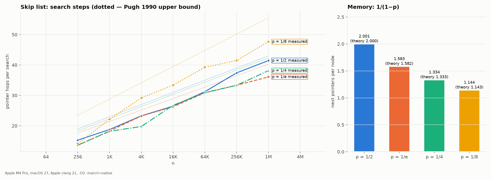

# 06. Skip list

The notes: notebook p.36–40 (PDF p.37–41). Code: [`src/skiplist.c`](../src/skiplist.c). Source: W. Pugh,
*Skip Lists: A Probabilistic Alternative to Balanced Trees*, CACM 33(6), 1990.

## Structure (correct)

A skip list is a **sorted** linked list (level 0) plus a hierarchy of increasingly sparse
"express lanes" (levels 1…L). Each node gets a random height: with probability p it is promoted to
the next level. The notes say "built in two layers" (P3-03). In fact there are log_{1/p} n levels on average.

Example from the notes — inserting 6, 29, 22, 9, 17, 4 (heights are random, shown here for illustration):

```
level 3: H ──────────────────────────────► 22 ──────────────────► ∅
level 2: H ──────────────────► 9 ────────► 22 ──────────────────► ∅
level 1: H ──► 4 ────────────► 9 ────────► 22 ──────────► 29 ───► ∅
level 0: H ──► 4 ──► 6 ──────► 9 ──► 17 ─► 22 ──────────► 29 ───► ∅

Search 17: H(3)→22? 22>17 ↓ H(2)→9 ✓ →22? ↓ 9(1)→22? ↓ 9(0)→17 ✓ found
```

## The notes' pseudocode does not work

All three algorithms (insert, delete, search) contain the same broken line (P3-07):

```
while a → forward[i] → key forward[i]            ← the notes
while a → forward[i] → key < key do a := a → forward[i]   ← Pugh 1990
```

| ID | Error | Consequence |
|---|---|---|
| P3-07 | the loop has no `< key` and no advance `a := a→forward[i]` | the loop either never runs or never ends |
| P3-11 | the relinking loop runs `for i = 0 to level` (variable `level` is undefined; it should be the height of the **new** node) | the node is inserted on the wrong levels |
| P3-14 | `update[i]→forward[i]→forward[i]` without an assignment | deletion deletes nothing |
| P3-17 | `a = a→forward[a]` | should be `forward[0]` |
| P3-NEW-2 | "level k" in the example = number of cells, but in the algorithm = highest index | root cause of P3-10, P3-11, P3-15: off-by-one |
| P3-04 | expected memory in the table is "—" | Θ(n) expected: n/(1−p) pointers |

The working version (`src/skiplist.c`) uses a single convention: `level` = number of levels, indices `0..level-1`:

```c
static skip_node *descend(skiplist *s, int key, skip_node **update) {
    skip_node *x = s->head;
    for (int i = s->level - 1; i >= 0; i--) {
        while (x->next[i] && x->next[i]->key < key) x = x->next[i];
        if (update) update[i] = x;
    }
    return x->next[0];
}
```

## Experiment: how p affects memory and speed



`results/skiplist.csv` (n ≈ 2²⁰, 200 000 successful searches):

| p | pointers per node (measured) | theory 1/(1−p) | steps per search | Pugh's bound L(n)/p + 1/(1−p) + 1 | ns per search |
|---|---|---|---|---|---|
| 1/2 | 2.001 | 2.000 | 41.4 | 43.0 | 249 |
| 1/e | 1.583 | 1.582 | 36.1 | 40.3 | 262 |
| 1/4 | 1.334 | 1.333 | 38.1 | 42.3 | 299 |
| 1/8 | 1.144 | 1.143 | 47.7 | 55.5 | 400 |

Step and pointer counts are deterministic (fixed seed) and do not change between runs. Time does:
in three runs this session p = 1/2 gave 280 / 262 / 249 ns, p = 1/e — 305 / 251 / 262 ns.

Conclusions supported by the measurements:

1. Memory matches theory to 3 decimal places: 1/(1−p).
2. Step counts do not exceed Pugh's bound — it is an **upper** bound, so measurements fall below it.
3. p = 1/e minimizes the expected number of steps in theory, and it is also best by steps in the measurement (36.1 vs 41.4).
   But **by time** p = 1/e and p = 1/2 are within noise (different runs were won by one or the other):
   13 % fewer steps gave no stable time advantage. Steps ≠ cache misses.
   Pugh recommends p = 1/4 as a memory/speed compromise — here it uses 33 % less memory
   than p = 1/2 and is 7–20 % slower (depending on the run).
4. Compare with AVL at the same n = 2²⁰ ([08-trees](08-trees.md)): 85 ns per search (random keys).
   The skip list is ~3 times slower: each step is a separate node at a random memory location.
