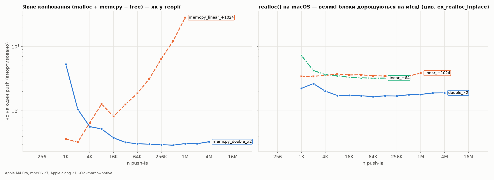

# 07. Стек і черга

Конспект: notebook p.41–47 (PDF p.42–48) + coding question 3 (notebook p.107–108).
Код: [`src/stack_queue.c`](../src/stack_queue.c).

## Стек (LIFO)

| Операція | Складність | Примітка |
|---|---|---|
| push | Θ(1) амортизовано | при рості ×2; при рості +K — Θ(n/K) амортизовано, див. експеримент |
| pop / peek | Θ(1) | `peek` повертає **верхній** елемент; конспект: «element at a given position» (P3-19) — це `peep(i)` |
| isEmpty / isFull | Θ(1) | |

### Помилки в push/pop конспекту

Псевдокод p.43 (P3-24, P3-25):

```
if top = n then stack full        ← після повідомлення виконання ПРОДОВЖУЄТЬСЯ
top = top + 1
stack(top) := item                ← запис за межі
```

Перевірка межі має **завершувати** операцію. Крім того, тест `top = n` суперечить конвенції «порожній ⇔ top = −1»
з тієї ж сторінки: для індексів 0..n−1 повний ⇔ `top = n − 1`.

Той самий off-by-one — у C-коді coding question 3 (P6-25):

```c
int MAXSIZE = 8; int stack[8]; int top = -1;
int isfull() { if (top == MAXSIZE) return 1; else return 0; }   // має бути MAXSIZE - 1
```

`make experiments` → `ex_ub_stack_isfull` (9 push у стек на 8):

```
1) isfull: top == MAXSIZE (конспект), 9 push у стек на 8 елементів
      | runtime error: index 8 out of bounds for type 'int[8]'
      | ERROR: AddressSanitizer: global-buffer-overflow
      | 0x… is located 0 bytes after global variable 'stack_' … of size 32
   [конспект] дочірній процес вбито сигналом 6 (Abort trap: 6)
2) isfull: top == MAXSIZE - 1 (виправлено)
      could not insert data, stack is full
      top після 9 push = 7
```

У самому конспекті push лише 6, тому баг «спить», а помилку не видно. Там же: `pop()` у гілці
«stack is empty» не повертає значення (P6-27, UB при використанні результату), останній `printf`
не компілюється — бракує `?` і `:` (P6-31).

### Експеримент: стратегія росту динамічного масиву



| Стратегія (явний `malloc+memcpy`) | n = 2¹⁶ | n = 2²⁰ | скопійовано елементів при n = 2²⁰ |
|---|---|---|---|
| ×2 | 0.31 нс/push | 0.31 нс/push | 1 048 568 (< n) |
| +1024 | 1.87 нс/push | **28.0 нс/push** | 536 346 624 (≈ n²/2048) |

Теорія підтверджена: при рості ×2 сумарне копіювання < n (геометрична прогресія), тобто push — Θ(1)
амортизовано. При рості +K копіюється Θ(n²/K), тож час на push росте лінійно з n.

**Але з `realloc` на macOS** (права панель) обидві стратегії дають рівну лінію. Причина виміряна, а не вгадана
(`ex_realloc_inplace`): великі блоки розширюються *на місці*, без копіювання:

```
 розмір  realloc    час realloc   malloc+memcpy того ж розміру
  64 МБ  на місці      12.7 мкс                   9381.2 мкс
 256 МБ  на місці       6.1 мкс                  24835.1 мкс
```

Висновок: «+K дає Θ(n²)» — властивість *моделі пам'яті*, а не закон природи. Подвоєння правильне
завжди. Покладатися на поведінку `realloc` конкретного аллокатора — ні.

### Застосування стеку (реалізовано й протестовано)

- `balanced_brackets("{[()()]}")` → 1; `"([)]"` → 0.
- `infix_to_postfix` (сортувальна станція Дейкстри) з правильною асоціативністю: `a-b-c` → `ab-c-`
  (лівоасоціативний), `a^b^c` → `abc^^` (правоасоціативний). Перевірено: `2^3^2` = 512, а не 64.
- `eval_postfix("231*+9-")` = −4.

## Черга (FIFO)

### Лінійна черга марнує місце

```
cap = 3: enqueue 1,2,3 → [1 2 3] front=0 rear=3
dequeue ×2            → [· · 3] front=2 rear=3
enqueue 4             → OVERFLOW, хоча 2 клітинки вільні      (тест: lq_enqueue → -1)
```

Конспект називає недоліком лінійної черги те, що «вставка лише з rear» (P3-28). Але це *визначення* черги.
Справжній недолік — хибне переповнення, показане вище.

### Кільцева черга

Індекс має **загортатися**: `rear = (rear + 1) % cap` (конспект: «simply incrementing rear», P3-29).
Реалізація `cqueue` зберігає `count` замість «залишити одну клітинку порожньою» — тоді корисні всі `cap` клітинок
(тест: черга на 3 приймає рівно 3).

### Помилки на діаграмах черги (p.45–47)

- Rear показано під 20 замість 30 (P3-27).
- «front increases from −1 to 0» після видалення (P3-31). Насправді з 0 до 1, і це видно на власному малюнку конспекту.
- «Go to step [END OF IF]» — номер кроку пропущено (P3-32).

### Пріоритетна черга

Ефективна реалізація — бінарна купа: `heap_push`/`heap_pop` за Θ(log n) (див. [08-trees](08-trees.md#бінарна-купа)).
Інтерв'ю-відповідь Q5 «потрібні дві черги» (P6-34) — фольклор: купі черги не потрібні взагалі.
