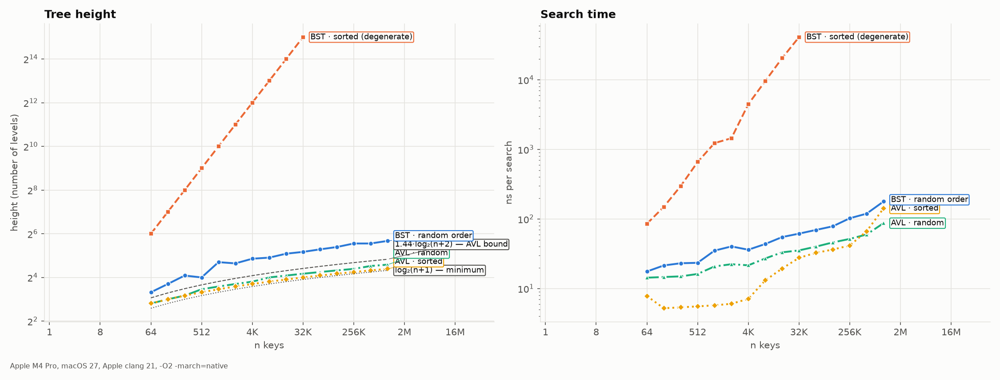
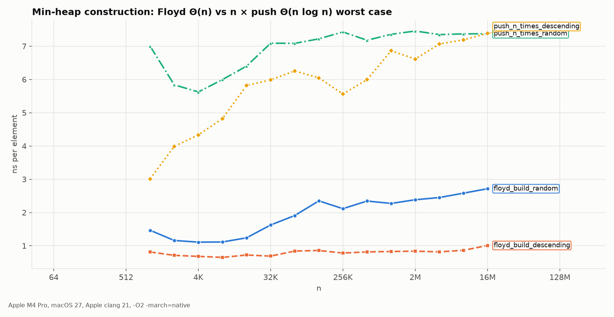

# 08. Trees: terminology, binary trees, BST, AVL, B/B+, heap

The notes: notebook p.48–62 (PDF p.49–63). Code: [`src/tree.c`](../src/tree.c).

## Terminology — corrections

| Term | The notes | Correct |
|---|---|---|
| child | "descendant of any node" (P3-33) | **immediate** descendant |
| descendant | "immediate successor" (P3-36) | any node in the subtree (child, grandchild, …) |
| leaf | "bottom-most node" (P3-34) | a node with no children (may not be on the last level) |
| incoming edges | "at least one incoming link" (P3-37) | **exactly one** for every non-root ⇒ n−1 edges |
| ancestors | "1, 2, 5 are ancestors of node 10" (P3-35) | the drawing has no node 10, and 5 is a leaf |

## Height: two conventions, and the notes mix them

Height can be counted in **edges** (h(leaf) = 0) or in **levels** (h(leaf) = 1). All formulas below
are given in edges, as in most of the notes' formulas:

| Quantity | The notes | Correct (h in edges) |
|---|---|---|
| max. nodes in a binary tree | 2^(h+1) − 1 | 2^(h+1) − 1 ✓ |
| min. height for n nodes | log₂(n+1) − 1 (P3-44) | **⌈log₂(n+1)⌉ − 1**: for n=4 the notes' formula gives 1.32, but height is an integer (2) |
| full BT: min. nodes | 2h − 1 (P3-46) | **2h + 1** (h=2 → 5 nodes) |
| full BT: max. height | (n+1)/2 (P3-47) | **(n−1)/2** (the notes' own example n=5 has h=2) |
| complete BT: height | log₂(n+1) − 1 (P4-01) | **⌊log₂ n⌋** |

In the code (`tree_height`) height is counted in **levels** (empty = 0, leaf = 1). This is stated in `dsa_tree.h`.

## BST

The notes' definition (P4-07) contains only the right half ("similarly … right subtree"); the left half is missing.
Complete: for **every** node x, all keys in the left subtree < x.key < all keys in the right subtree.

**Trap:** checking "left child < parent < right child" at every node is **not sufficient**. Counterexample
(`test_bst_validity_trap`):

```
      10
     /  \
    5    15
        /
       6        ← 6 < 15 (locally OK), but 6 < 10 in the RIGHT subtree of 10 → not a BST
```

`bst_is_valid` checks a range (lo, hi) passed down the tree.

### The notes' example verified automatically

Inserting 43, 10, 79, 90, 12, 54, 11, 9, 50 (notebook p.56). The notes' tree is correct; the test
`test_bst_from_notes` checks all four traversals:

```
            43
          /    \
        10      79
       /  \    /  \
      9   12  54   90
          /   /
        11   50

preorder:  43 10 9 12 11 79 54 50 90
inorder:   9 10 11 12 43 50 54 79 90     ← always sorted for a BST
postorder: 9 11 12 10 50 54 90 79 43
level:     43 10 79 9 12 54 90 11 50
```

The notes: "three types of traversals" (P4-06) — **level-order** (breadth-first, via a queue) is missing.

### Deletion — 3 cases (`bst_delete`)

0 children → just delete; 1 child → replace with the child; 2 children → copy the key of the in-order successor
(the minimum of the right subtree) and delete that node. Test: deleting 43 (the root, 2 children) makes 50 the root.

## AVL

Balance factor bf = h(left) − h(right) ∈ {−1, 0, 1} for **every** node. On p.54 the notes justify
balance by the difference at the root (P4-04); all nodes must be checked. On p.58, the example for node 50
says "1−2=1" without the minus sign (P4-NEW-1).

| Case | Insertion into… | Fix | Rotations (test) |
|---|---|---|---|
| LL | left subtree of the left child | right rotation | 1 |
| RR | right subtree of the right child | left rotation | 1 |
| LR | right subtree of the left child | left + right | 2 |
| RL | left subtree of the right child | right + left | 2 |

AVL height is **not** equal to log n (P4-09). The Adelson-Velsky–Landis / Knuth bound (TAOCP vol. 3, §6.2.3):
h < 1.4405·log₂(n+2) − 0.3277.

### Experiment: BST vs AVL



`results/bst_avl.csv`:

| n | input | BST height | AVL height | log₂(n+1) | BST ns/search | AVL ns/search |
|---|---|---|---|---|---|---|
| 1 024 | random | 26 | 12 | 10.0 | 30.6 | 18.2 |
| 1 024 | sorted | **1 024** | 11 | 10.0 | **1 107.1** | 5.5 |
| 32 768 | sorted | **32 768** | 16 | 15.0 | **41 092.2** | 27.3 |
| 1 048 576 | random | 51 | 24 | 20.0 | 189.8 | 85.4 |

- Sorted input turns a BST into a list: height = n, search is Θ(n) — 1 503 times slower than AVL at n = 32 768.
- Average node depth in a random BST at n = 2²⁰: measured **24.19**. The exact formula for the expected
  average depth 2(1+1/n)·Hₙ − 4 = **24.88** (Hₙ is the harmonic number). A 3 % discrepancy on a single instance.
- AVL performs on average 0.70 rotations per insertion (random input) and 1.00 (sorted input).
- AVL on sorted input is **faster** than AVL on random input (5.5 vs 18.2 ns at n=1024): the query keys
  are taken with stride 7919 from the sorted array, and search paths partially overlap — better cache locality.

## B-tree and B+-tree

- Every node except the root has **⌈m/2⌉..m** children. The notes say "m/2" without the ceiling (P4-11) and "root must have at least 2 *nodes*" (P4-12);
  correct: the root, if it is not a leaf, has at least 2 **children**.
- The example of searching for 49 in a tree with root 78 (P4-13) refers to a tree that **is never drawn**.
  The only B-tree in the notes (p.60) has root 60 and contains neither 49 nor 78.
- O(log n) search for fixed m is **correct** (error candidate rejected, CLRS §18.2: O(t·log_t n)).

## Binary heap

The notes: "A heap is a complete binary tree" (P5-32). The key part is missing: the **heap property**
(in a max-heap a parent's key ≥ its children's keys). Array with 0-based indexing: parent (i−1)/2, children 2i+1, 2i+2.

### Experiment: building a heap in Θ(n), not Θ(n log n)



| n = 2²⁴ | Floyd (`heap_build`) | n × `heap_push` |
|---|---|---|
| random input | 2.56 ns/elem | 7.09 ns/elem |
| descending input (worst case for push into a min-heap) | 1.00 ns/elem | 7.23 ns/elem |

Why Floyd is linear: sift-down from a node at height k costs O(k), and there are ≈ n/2^(k+1) nodes at height k;
Σ k·n/2^(k+1) = n·Σ k/2^(k+1) = n. Here, descending input is the worst case for push into a min-heap (every new
element bubbles up to the root), but not for Floyd.
