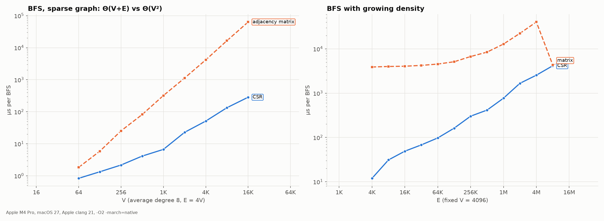

# 09. Graphs, BFS/DFS, spanning trees

The notes: notebook p.62–71 (PDF p.63–72). Code: [`src/graph.c`](../src/graph.c).

## Definitions — corrections

| The notes | Correct |
|---|---|
| "G(V, E) — an ordered set" (P4-19) | G = (V, E) — an **ordered pair** of sets |
| "weighted graph: each **node** is assigned data such as length" (P4-24) | weights belong to **edges**: w : E → ℝ |
| "w(e) must be positive" (P4-25) | weights may be 0 or negative (which is why Bellman–Ford exists, CLRS ch. 24); Dijkstra requires w ≥ 0 |
| "complete graph has n(n−1)/2 edges" (P4-23) | only for a simple **undirected** graph; a complete digraph has n(n−1) |
| "simple path" describes a **closed** simple path (P4-20) | a simple path has no repeated vertices |
| "Diagraph" (P4-26) | digraph (directed graph) |

## Representation

| | Adjacency matrix | Adjacency list (CSR) |
|---|---|---|
| Memory | Θ(V²) | Θ(V + E) |
| Is (u,v) an edge? | Θ(1) | Θ(deg u), or Θ(log deg u) for sorted neighbors |
| Iterate over all neighbors of u | Θ(V) | Θ(deg u) |
| BFS/DFS | **Θ(V²)** | **Θ(V + E)** |

The notes' weighted matrix marks "no edge" with zero (P4-28). Then an edge of weight 0 cannot be distinguished from a missing one;
the correct choice is ∞ or a separate flag.

### Experiment: BFS on a matrix vs CSR



`results/graph_bfs.csv`, simple sparse graph (E = 4V, no self-loops or duplicates):

| V | CSR | matrix | CSR memory | matrix memory |
|---|---|---|---|---|
| 1 024 | 9.6 µs | 482.0 µs | 40 KB | 1 MB |
| 16 384 | 296.6 µs | 62 802.0 µs | 640 KB | 256 MB |

When V doubles, matrix time grows about 4× (Θ(V²)), and CSR about 2× (Θ(V+E)).
At V = 16 384 the matrix is 212 times slower. (Small V are noise-sensitive: at V = 1024 CSR gave 9.6 µs in this run and 29.3 µs in the previous one; at V = 16 384 — 296.6 vs 304.0, stable.)

`results/graph_density.csv` (V = 4096, density grows all the way to the **complete** graph, E = 8 386 560):

- on the complete graph the matrix **caught up** with CSR: 3.86 ms vs 4.27 ms (in the previous run 4.23 vs 4.13 —
  i.e. equal within noise). This is exactly the point where Θ(V²) = Θ(V+E): both iterate over V² cells/arcs;
- at half density (E = 4 194 304) the matrix is 12 times slower than on the complete graph (45.1 ms vs 3.9 ms),
  even though the number of cells is the same. The likely cause is the unpredictability of the condition `row[v] && !seen[v]` when half of the cells
  are 1 in random order, whereas on the complete graph they are all ones. This is a **hypothesis**: branch-miss counters
  cannot be measured on macOS without root.

> Methodological note: the first version of the generator allowed duplicate edges and self-loops. CSR kept the duplicates,
> but the matrix did not, so on the "complete" graph CSR had up to 1.58× more arcs, and the conclusion "CSR is 7 times faster
> even on the complete graph" was wrong. Found during code review and fixed.

## BFS — errors in the notes

1. The adjacency lists on p.68 contain B→F and E→B, **which are not in the drawing** (P4-31). The answer
   A→B→C→E is correct for both versions (checked by hand).
2. The algorithm stores only STATUS, so it **cannot output the path** (P4-32). A predecessor array
   PRED[v] (or dist[], as in `bfs_csr`) is needed. A vertex must be marked **when it is enqueued**, otherwise it
   ends up in the queue several times (comment in `bfs_csr`).

## DFS — the notes' algorithm produces a non-DFS order

Step 5 in the notes (p.69, P4-33) marks a vertex as "waiting" **at push time**. Counterexample
(`make experiments` → `ex_dfs_mark_on_push`), edges A–B, A–C, A–D, B–D:

```
notes (mark on push):  A D C B
correct (mark on pop): A D B C
```

After D, a true DFS must go to an unvisited neighbor of D, i.e. B. The notes process C,
which is not a neighbor of D. So A D C B is not the order of any DFS. Correct: mark on pop
(a vertex may sit on the stack several times) or use recursion. `dfs_csr_iterative` emulates recursion with an explicit stack of
frames (vertex, next edge) and produces an order identical to `dfs_csr_recursive` (test `test_graph`).

## Spanning trees

- "edges(spanning tree) = edges(graph) − 1" (P4-36, **error**): **|E(T)| = |V| − 1**. The notes' formula
  gives the right number only because the example is a cycle of 5 vertices (E = V).
- Errors in the drawing on p.69: edge 2–3 is labeled "1" instead of 4 (sum 12 = 1+4+5+2, P4-37); a vertex
  is labeled "9" instead of 4 (P4-38).
- Enumerating all 5 spanning trees of the cycle (removing one edge at a time) gives weights 14, 12, 11, 10, 13; the notes show 4 of them.
  MST = {1, 2, 3, 4}, weight 10 — **correct**.
- "Equal weights ⇒ more than two MSTs" (P4-45): equal weights only *allow* multiple MSTs.
  "Distinct weights ⇒ a unique *spanning* tree" (P4-46): a unique **minimum** spanning tree.

## Topological sort (extra)

`topo_sort_kahn` (Kahn, 1962) returns −1 for a graph with a cycle. The test checks that every arc u→v
points forward in the computed order.
