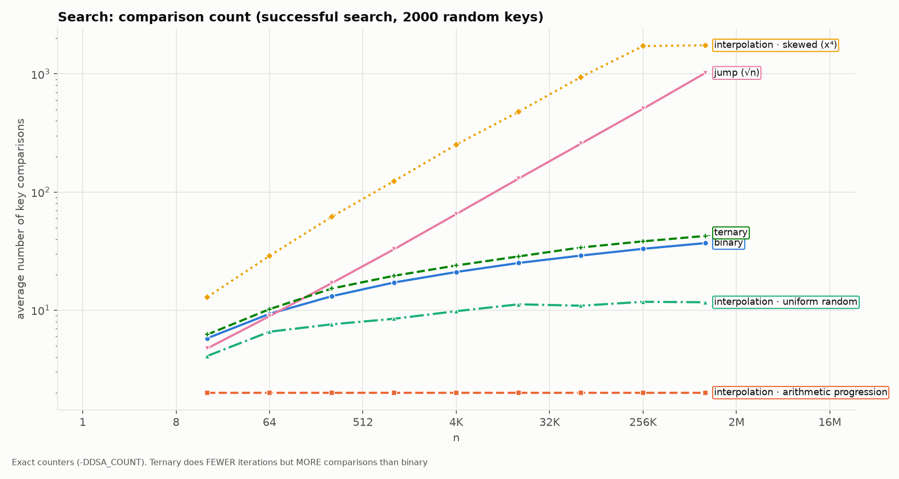
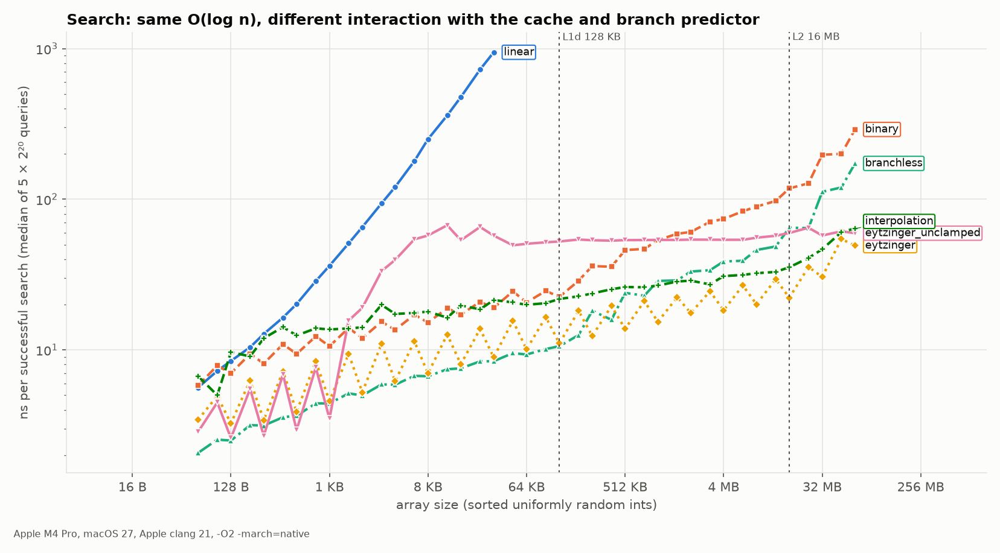

# 10. Searching

Notes: notebook p.71–78 (PDF p.72–79). Code: [`src/search.c`](../src/search.c) (8 algorithms).

## Linear search: errors in the notes' code

| Line | Problem | ID |
|---|---|---|
| `SET POS = 1` | should be `POS = I`: the position of the found element, not the constant 1 | P5-01 |
| `scanf("%d", item);` | missing `&`: scanf writes to the address equal to the uninitialized value of item — UB | P5-04 |
| `void main ()` | clang: `error: 'main' must return 'int'` | P5-03 |

Improvement: a **sentinel** (`search_linear_sentinel`). Put the key at the end of the array, and the loop keeps one
check (`a[i] != key`) instead of two (`i < n && a[i] != key`).

## Binary search

### Overflow in `(beg + end) / 2`

The notes use `MID = (BEG + END)/2` (P5-07). For `int` indices with beg + end > INT_MAX this is
signed integer overflow, i.e. UB (C11 6.5p5). `make experiments` → `ex_binary_overflow`:

```
           beg            end      (beg+end)/2  beg+(end-beg)/2
             0            100               50               50
    1073741824     1073741834      -1073741819       1073741829
    2147483637     2147483645               -7       2147483641
```

An array of > 2³⁰ ints takes > 4 GB, which is an entirely realistic size. The same bug lived for 9 years
in `java.util.Arrays.binarySearch` (J. Bloch, 2006). The implementation here uses `size_t` and a half-open
interval `[lo, hi)`, so there is neither overflow nor `hi = mid − 1` with unsigned underflow.

### Other errors

- The function is declared as `binarysearch` but defined as `Binary search` (a space, capital B) — does not compile (P5-11).
- The example on p.76 gives position **7** (0-based), but the program returns `mid+1` (1-based), so for the same array it prints 8 (P5-10).
- "O(1) space" is correct for the iterative pseudocode; the recursive C version uses Θ(log n) stack (P5-08).

### Number of comparisons (exact)

`results/search_ops.csv`, n = 2²⁰, successful searches, the same sample of 2000 keys for all algorithms (uniform random data unless stated otherwise):

| Algorithm | Average | Maximum | Theory |
|---|---|---|---|
| binary | 36.9 | 39 | ≤ 2·(⌊log₂n⌋+1) = 42 (2 comparisons per iteration: `==` and `<`) |
| ternary | 42.5 | 49 | **more** than binary: log₃n iterations, but up to 4 comparisons per iteration |
| exponential | 53.4 | 58 | 2·log₂(pos) + binary search within the range |
| jump (√n) | 1 019 | 2 032 | ≈ √n/2 + √n/2 on average, ≤ 2√n |
| interpolation, arithmetic progression | **2.0** | 2 | guesses on the first probe (degenerate "ideal" input) |
| interpolation, uniform random | **11.6** | 29 | Θ(log log n) expected (up to 3 comparisons per probe) |
| interpolation, skewed (x⁴) | **1 746** | 18 101 | worst Θ(n) — worse than jump |



**Conclusion:** interpolation search is good on uniform data and catastrophic on skewed data.
Methodological note: the first version of the benchmark used a[i] = 2i (an arithmetic progression), where
interpolation *always* hits on the first probe. That produced "2 comparisons" and 1.6 ns. The review caught this,
and "uniform" now means sorted random keys.
Ternary search is worse than binary for searching an array (a common myth is that "3 parts beat 2").

## Time: same O(log n), different reality



`results/search_time.csv` (ns per search, median of 5 runs of 2²⁰ queries):

| n (size) | binary | branchless | eytzinger | interpolation |
|---|---|---|---|---|
| 1 024 (4 KB) | 13.53 | 5.70 | 6.05 | **16.70** |
| 65 536 (256 KB) | 34.72 | 18.08 | 11.96 | 22.83 |
| 1 048 576 (4 MB) | 71.78 | 38.17 | 17.51 | 29.60 |
| 16 777 216 (64 MB) | 296.9 | 170.4 | 73.53 ⚠ | 66.39 |

⚠ **Eytzinger at 64 MB is unstable across runs**: over 7 runs the values are bimodal — ~50 ns
(50.1, 49.4, 53.5, 49.5) or ~75 ns (74.3, 73.5, 75.2), while binary and branchless vary within ±7 %.
The cause has not been established (candidates: placement of the 64 MB buffer in physical memory / TLB, scheduling on P/E cores;
neither has been verified). So the conclusions below rely on n = 2²⁰, where all runs agree within 8 %.

Keys are sorted uniform random ints. At n = 1024 interpolation is **slower** than binary (16.70 vs 13.53 ns), even though it makes
fewer comparisons. The likely cause is a 64-bit division on every probe (not profiled separately).

An unexplained observation from the chart: the `eytzinger` and `eytzinger_unclamped` curves have a "sawtooth" —
at n = 1.5·2ᵏ search is consistently slower than at the neighboring n = 2ᵏ (e.g. 6.05 vs 11.25 ns at n = 1024 and n = 1536).
The cause has not been investigated (candidate: the incomplete last level of the implicit tree).

Three improvements **without changing the asymptotics**:

1. **Branchless** (`search_branchless`): a fixed number of iterations; the body compiles to `csel`
   instead of a conditional jump. At each step of binary search the direction is a 50/50 coin flip, so the branch
   predictor mispredicts on roughly half the steps. Gain ~2×.
2. **Eytzinger layout**: a change of *data structure*, not algorithm. The array is rearranged in BFS order
   of an implicit tree (children of k are 2k and 2k+1). The top levels of all searches sit together, and the next 4 levels can be
   **prefetched** ahead of time: they occupy a contiguous block. At 4 MB it is **4.1×** faster than classic binary search (17.51 vs 71.78 ns; stable across all runs).
   At 64 MB it is 4.0–6.2× faster depending on the run (see ⚠ above).
3. **Prefetch trap** (`eytzinger_unclamped`): an unclamped prefetch of `b + 16k` goes past the end of the array onto
   not-yet-mapped pages. The result is 38.1 ns instead of 6.05 ns at n = 1024, i.e. the "optimization" makes things
   6× worse. Interestingly, at 64 MB the unclamped version (58.3 ns) is sometimes faster than the clamped one in its
   "slow" mode (73.5 ns): there the prefetch jumps leave the array only on the last levels. Clamping the index to n fixed this.

At n = 16 (64 B) branchless (2.0 ns) is 3× faster than plain binary (6.4 ns), and linear search takes
6.4 ns — the same as binary. (At small n the run-to-run noise is large: linear at n = 16 ranged from 5.8 to 12.6 ns
across runs in this session; branchless was a stable 2.0–2.3.) At small n, branches and constants decide, not asymptotics.
