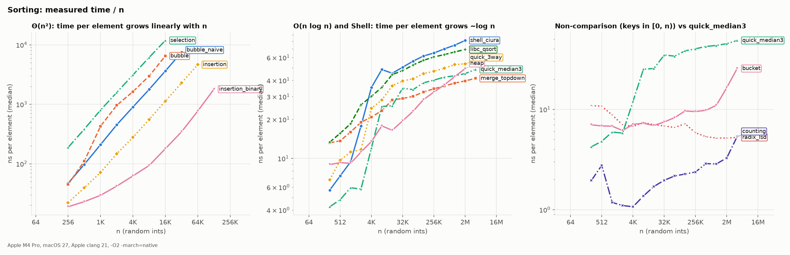
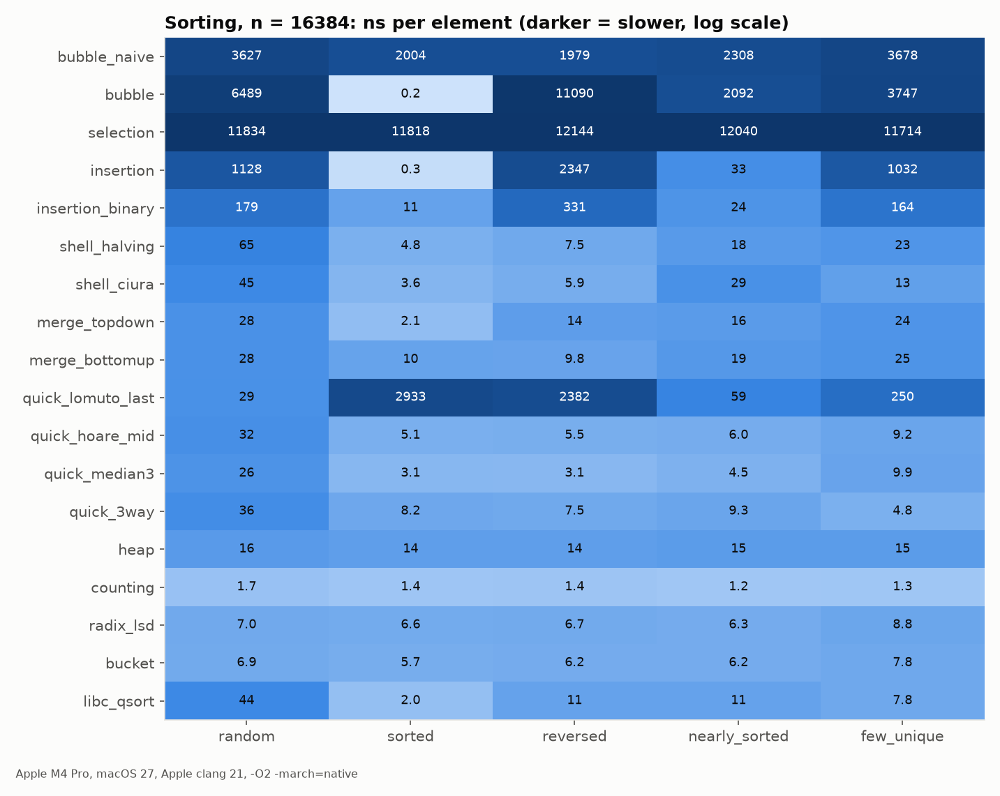

# 11. Sorting

Notes: notebook p.78–92 (PDF p.79–93). Code: [`src/sort.c`](../src/sort.c) — 18 algorithms.
This section of the notes has the most errors: 41 (19 unambiguous).

## Summary table (verified by measurement)

| Algorithm | Best | Average | Worst | Memory | Stable | Function |
|---|---|---|---|---|---|---|
| Bubble (with flag) | Θ(n) | Θ(n²) | Θ(n²) | Θ(1) | yes | `sort_bubble` |
| Bubble (no flag, as in the notes) | **Θ(n²)** | Θ(n²) | Θ(n²) | Θ(1) | yes | `sort_bubble_naive` |
| Selection | Θ(n²) | Θ(n²) | Θ(n²) | Θ(1) | no | `sort_selection` |
| Insertion | Θ(n) | Θ(n²) | Θ(n²) | Θ(1) | yes (with `<`!) | `sort_insertion` |
| Shell (Ciura) | Θ(n log n) | exact bound unknown; measured below | unknown | Θ(1) | no | `sort_shell` |
| Merge | Θ(n log n)* | Θ(n log n) | Θ(n log n) | Θ(n) | yes | `sort_merge` |
| Quick (Lomuto, pivot = last) | Θ(n log n) | Θ(n log n) | **Θ(n²) on sorted input** | Θ(log n)** | no | `sort_quick_lomuto_last` |
| Quick (median-of-3) | Θ(n log n) | Θ(n log n) | Θ(n²) (rare) | Θ(log n)** | no | `sort_quick_median3` |
| Quick 3-way | **Θ(n)** on equal keys | Θ(n log n) | Θ(n²) | Θ(log n)** | no | `sort_quick_3way` |
| Heap | Θ(n log n)*** | Θ(n log n) | Θ(n log n) | Θ(1) | no | `sort_heap` |
| Counting | Θ(n+k) | Θ(n+k) | Θ(n+k) | Θ(n+k) | yes | `sort_counting` |
| Radix LSD (4×8 bits) | Θ(n) | Θ(n) | Θ(n) | Θ(n) | yes | `sort_radix_lsd` |
| Bucket | Θ(n) | Θ(n) for uniform | Θ(n²) | Θ(n) | yes | `sort_bucket` |

\* our `sort_merge` skips the merge if `a[mid-1] <= a[mid]`: on sorted input exactly n−1 comparisons (measured 16 383 at n=16 384).
\*\* provided recursion goes into the **smaller** part (implemented everywhere); otherwise the worst-case stack is Θ(n).
\*\*\* for distinct keys; on equal keys — Θ(n) (P5-37).

## Bubble sort: the notes' bubble sort is not bubble sort

1. **The pseudocode is a single pass** (P5-13). `ex_bubble_variants`: `{10,35,32,13,26}` → `10 32 13 26 35` — NOT sorted.
2. **The C code compares `a[i]` with `a[j]` for j > i** (P5-15): these are not adjacent elements, so this is *exchange sort*.
   It sorts the array correctly, but contradicts the notes' own definition ("compares adjacent elements").
3. **"Best case O(n)"** (P5-14) — only with an early-exit flag, which is in neither the pseudocode nor the code.
4. `sizeof(a) / sizeof(a0)` — does not compile (P5-16).

Measured (`ex_bubble_variants`, n = 2000):

```
input      exchange (the notes)       bubble + flag
           comparisons swaps          comparisons swaps
random       1999000    986386          1997404    986386
sorted       1999000         0             1999         0
reversed     1999000   1999000          1999000   1999000
```

The number of swaps is the same (it equals the number of inversions). The only difference is the best case: 1 999 vs 1 999 000.

## Insertion sort: `<=` breaks stability and the best case

The notes: `while (j>=0 && temp <= a[j])` (P5-47). `ex_insertion_le`:

```
temp <= a[j] (the notes): (1,#3) (1,#1) (2,#4) (2,#2) (2,#0) -> UNSTABLE
temp <  a[j] (fixed): (1,#1) (1,#3) (2,#0) (2,#2) (2,#4) -> stable

Shifts on an array of n equal keys:
       n   <= (the notes)        < (fixed)
   16000       127992000                0   (n(n-1)/2 = 127992000)
```

One character turns the best case Θ(n) into the worst case Θ(n²) for input of equal keys.

## Heap sort: `largest != 1` — infinite recursion

The notes (p.87, P5-40): `if (largest != 1)` instead of `!= i`. When node i is already larger than its children,
`largest == i`. For i ≠ 1 the condition is true, swapping a[i] with itself changes nothing, and the recursion is called
with the same arguments. `ex_heapify_bug`:

```
largest != 1 (the notes): recursion depth exceeded 100000 -> in real code this is a stack overflow
largest != i (fixed): sorted, max recursion depth = 3: 1 10 23 26 28 43 48
```

The verifier separately compiled the notes' code (with the syntax fixed) and got exit 139 (SIGSEGV).
In addition, the notes' heap sort is missing `;` after three declarations and `)` in two `if`s (P5-38, P5-39),
the `for` uses commas instead of `;` (P5-41), and `heapsort` is defined while `heapSort` is called (P5-42).

## The notes' "bucket sort" is counting sort with a buffer overflow

Code on p.83–84 (P5-26, P5-29): `int bucket[max]`, but indexed `0..max`. `ex_ub_counting_bucket` on
the notes' input `{54, 12, 84, 57, 69, 41, 9, 5}`:

```
1) int bucket[max] (the notes)
      | runtime error: index 84 out of bounds for type 'int[max]'
      | ERROR: AddressSanitizer: dynamic-stack-buffer-overflow
   [the notes] child process killed by signal 6 (Abort trap: 6)
2) int bucket[max + 1] (fixed)
      result: 5 9 12 41 54 57 69 84
```

A real bucket sort is `sort_bucket`: n buckets by range, sorting within each bucket.
The memory figure "O(n·k)" in the notes' table (P5-25) is wrong; the correct one is Θ(n+k). Stability "may or may not" (p.81) contradicts
"YES" in the table on p.83 (P5-20): correct answer — stable if the sort within buckets is stable.

**Bucket sort's weak spot** is a non-uniform distribution: if Θ(n) *distinct* keys land in one bucket,
the insertion sort inside it costs Θ(n²). My initial prediction that this would happen on the `few_unique` input (8 distinct values)
was **refuted** by measurement: 7.2 ns/elem even at n = 4M. All keys in a bucket are equal, and insertion sort on equal
keys (with `>`) does no shifts, so each bucket is processed in linear time.

## Quicksort: choosing the pivot


`results/sort_ops.csv`, n = 16 384, **sorted** input:

| Variant | Comparisons | |
|---|---|---|
| Lomuto, pivot = last | 134 209 536 | = n(n−1)/2, Θ(n²) |
| Hoare, pivot = middle | 245 759 | ≈ 1.07·n·log₂n |
| median-of-3 | 183 292 | ≈ 0.80·n·log₂n |

**Duplicates are Lomuto's second trap.** Input `few_unique` (8 distinct values), n = 16 384: 16 834 336 comparisons,
and each doubling of n multiplies the count by exactly 4. Analysis: Lomuto puts keys equal to the pivot on one side,
so a group of m equal keys costs m²/2. With 8 groups of n/8 this is 8·(n/8)²/2 = n²/16 = 16 777 216. Measured: 0.3 % more.
3-way partition (`quick_3way`) on the same input — 4.4 ns/elem vs 241 for Lomuto (`sort_heatmap.png`).

The textbook version with the last element as pivot degrades to Θ(n²) precisely on the most common
"real-world" input — already sorted. Recursing into the smaller part does not change the time, but bounds the stack to Θ(log n);
without it the worst case is also Θ(n) stack frames.

## Merge sort

The merge code in the notes is **correct** (the verifier ran it on duplicates, negatives and on a single
element). But the notes have no `mergeSort` or `main` functions (P6-03), and `int LeftArray[n1]` is a VLA on the stack:
VLAs are optional in C11 (`__STDC_NO_VLA__`), and for large n the stack will overflow (P6-04).
`sort_merge` allocates one buffer for the whole sort.

## Time: what is actually faster




Random ints, n = 4 194 304 (`results/sort_time.csv`):

| Algorithm | ns/element |
|---|---|
| counting (keys in [0, n)) | 5.1 |
| radix_lsd (keys in [0, n)) | 5.2 |
| bucket | 23.6 |
| merge_topdown | 40.3 |
| quick_median3 | 47.5 |
| heap | 51.8 |

Non-obvious measured facts:

- `heap` makes ~1.8·n·log₂n comparisons vs ~0.96·n·log₂n for merge, and at n ≥ 2M it is slower than merge and
  median-of-3 (45.3 vs 38.7 and 44.2 ns/elem at n = 2M). At the same time it is faster than `quick_hoare_mid`, `quick_3way`,
  `quick_lomuto_last`, `libc_qsort` and Shell.
- Shell (Ciura): the local exponent of the comparison count log₂(cmp(2n)/cmp(n)) from `sort_ops.csv`
  falls from 1.32 (n = 16→32) to 1.10 (n = 128K→256K). This behavior is close to n log n, not n^1.25.
  Yet in time Shell is the slowest of the subquadratic sorts (77.2 ns/elem at n = 2M).
- `libc_qsort` is slower than our implementations (50.5 vs 34.0 ns/elem for quick_median3 at n = 65 536): the
  comparator call through a function pointer on every comparison is not inlined.
- `insertion_binary` makes 323× fewer comparisons than `insertion` (206 660 vs 66 749 931 at n = 16 384), but
  the same number of moves (66 733 552). So it is only 5.9× faster (`memmove` is fast), not 323×.
